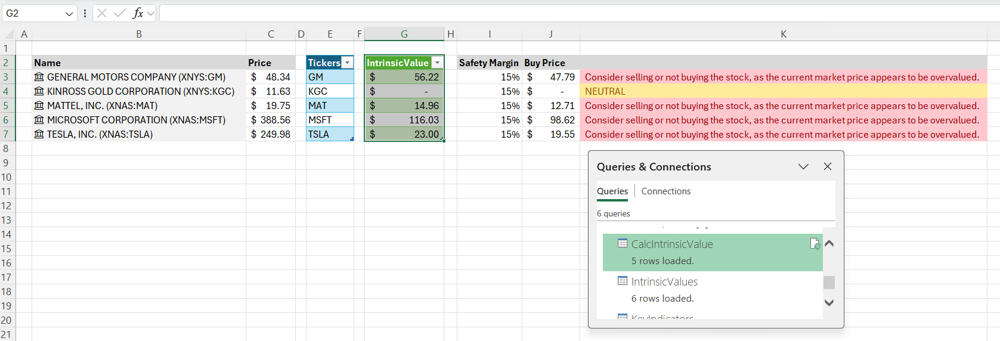

<a name="readme-top"></a>

<!-- PROJECT LOGO -->
<br />
<div align="center">
  <a href="https://github.com/Adam-Gladstone/YFinanceService">
    
  </a>

  <h3 align="center">YFinanceService (v1.0)</h3>

  <p align="center">
    <br />
    <a href="https://github.com/Adam-Gladstone/YFinanceService"><strong>Explore the docs >></strong></a>
    <br />
    <br />
    <a href="https://github.com/Adam-Gladstone/YFinanceService/issues">Report Bug</a>
    ·
    <a href="https://github.com/Adam-Gladstone/YFinanceService/issues">Request Feature</a>
  </p>
</div>

<!-- TABLE OF CONTENTS -->
<details>
  <summary>Table of Contents</summary>
  <ol>
    <li>
      <a href="#about-the-project">About The Project</a>
      <ul>
        <li><a href="#built-with">Built With</a></li>
		<li><a href="#project-structure">Project Structure</a></li>
      </ul>
    </li>
    <li>
      <a href="#getting-started">Getting Started</a>
      <ul>
        <li><a href="#prerequisites">Prerequisites</a></li>
        <li><a href="#installation">Installation</a></li>
      </ul>
    </li>
    <li><a href="#usage">Usage</a></li>
    <li><a href="#roadmap">Roadmap</a></li>
    <li><a href="#license">License</a></li>
    <li><a href="#contact">Contact</a></li>
    <li><a href="#acknowledgments">Acknowledgments</a></li>
  </ol>
</details>

<!-- ABOUT THE PROJECT -->
## About The Project
This project started out as an attempt to solve a specific problem. I wanted to calculate the intrinsic value of a stock (or stocks) based on Graham's formula in Excel (https://www.youtube.com/watch?v=8jmjxXc5H8c). 

The formula itself is quite simple (https://stablebread.com/how-to-calculate-the-intrinsic-value-of-a-company-like-benjamin-graham/). However, obtaining the input data programmatically in order to perform the calculation in Excel was somewhat challenging. Since the data is readily available via __yfinance__ using Python, it seemed to me easier therefore to do the calculation in Python. Then the problem was how to call this function from Excel. I had already tried something similar using my own __ExcelRAddIn__ (https://github.com/Adam-Gladstone/Office365AddIns) and an R package called *reticulate* to run a Python script. This works, but is rather roundabout. So I decided to experiment with an alternative approach using a Flask service. The Flask service defines some API endpoints which can be used via Excel's Power Query functionality. The result is shown below.


In summary, the arrangement that we have is:
- The __YFinanceService__ API query ("What is the intrinsic value of this stock using Graham's formula?") takes its parameters and inputs from an Excel table and invokes the 'function' via the Power Query Web Connector (https://learn.microsoft.com/en-us/power-query/connectors/web/web).
- The calculation is done in Python using data from __yfinance__.
- The result is served up over Flask endpoints (the API).
- The result data is massaged using Power Query Web Connector and used in the Excel worksheet for additional calculations.

Advantages of this approach
- simple to debug (on the Python side); somewhat less so using the Power Query M language.
- relatively simple to extend: you can add more functionality on the Python side, and/or extend the Flask API to support additional endpoints that expose more of the data from __yfinance__.

Disadvantages
- The performance is not particularly good. Specifically, in this case we needed some data from another finance package __yahoofinance__. The underlying mechanism requires web-scraping specific yahoo finance pages (and tables and elements etc.) which results in relatively slow performance.

<p align="right">(<a href="#readme-top">back to top</a>)</p>

### Built With

* Python 3.12
* yfinance 0.2.54
* yahoo_fin 
* Flask 3.0.3
* Pandas 2.2.2

### Project Structure

#### \YFinanceService
The __YFinanceService__ is the main Python project. 

This directory contains the definitions of the Flask API endpoints and the setup of the service.

##### \resources
In this directory we define the main endpoints of the __YFinanceService__.
- ```version.py``` - this is a simple API to obtain the version info from the Flask service.
- ```valuation.py``` - this contains the valuation function(s), specifically ```stock_valuation_graham```.
- ```finance_data.py``` - this contains the Flask API definitions for performing the intrinsic value calculation and for obtaining ticker data items.

##### \tests
- ```test_app.py``` - contains simple tests of the Flask service
- ```test_valuation.py``` - contains a test of the valuation function

#### \Docs
Project documentation, references and notes.

#### \Excel
This contains an Excel workbook - ```Stock Valuation.xlsx``` - which exercises both the stock valuation calculation and the ticker data.

#### \Images
Project images.

<p align="right">(<a href="#readme-top">back to top</a>)</p>

<!-- GETTING STARTED -->
## Getting Started
The project can be downloaded from the GitHub repository in the usual way.

### Prerequisites
* Flask==3.1.0
* flask_restx==1.3.0
* pandas==2.2.3
* pytest==8.3.4
* yahoo_fin==0.8.9.1
* yfinance==0.2.54

### Installation
At the command prompt type:

```pip install -r /path/to/requirements.txt```

<p align="right">(<a href="#readme-top">back to top</a>)</p>

<!-- USAGE EXAMPLES -->
## Usage

### Running the tests

cd to the ```\tests``` subdirectory.

At the command prompt, type ```pytest```

### Running the service

cd to the ```\YFinanceService``` subdirectory.

At the command prompt, type ```python YFinanceService.py```

Or run the debugger directly from within VSCode.

You should see a message similar to the following:


To test the service from a browser, type in the address bar:

"http://localhost:5000/YFinanceService/VersionInfo" 

and you should see the json response packet: 

{"VersionInfo": {"flask": "3.1.0", "yfinance": "0.2.54", "pandas": "2.2.3"}}

### YFinanceService

The file ```YFinanceService.py``` defines the APIs for the Flask service. The __YFinanceService__ consists of four main APIs (endpoints):

* TickerInfo
* TickerData
* IntrinsicValue
* IntrinsicValues

With the service running, the APIs can be exercised via a browser using the examples below (assuming the service is running on port 5000).
Currently the inspection and passing of parameters via a tool like Swagger is not supported. All the parameter parsing is handled manually in the endpoint definitions.

```TickerInfo``` is used to retrieve the complete ```TickerInfo``` dictionary for a single ticker. 

The only parameter it takes is a single ticker.

For example: http://localhost:5000/YFinanceService/TickerInfo?ticker=AMZN retrieves the complete dictionary for Amazon.

```TickerData``` retrieves the specified fields from the ```TickerInfo``` structure for a list of tickers and returns the result as a table with the tickers forming the rows and the fields forming the columns.

The parameters are a comma-separated list of ticker symbols and a comma-separated list of fields (key names in the ```TickerInfo``` dictionary). This provides a relatively flexible way to obtain stock financial data.

For example to obtain the following indicators:
* trailingPegRatio
* trailingPE 
* forwardPE
for the symbols: MSFT, AMZN, WAL and TSLA we can create the following query:
http://localhost:5000/YFinanceService/TickerData?tickers=MSFT,AMZN,WAL,TSLA&fields=trailingPegRatio,trailingPE,forwardPE

```IntrinsicValue``` is used to calculate the intrinsic value of a single stock using Graham's formula.

The parameters are:
* ticker - The ticker symbol
* avg_yield - The average yield of AAA Corporate Bonds
* cur_yield - The current yield of AAA Corporate Bonds

For example, to determine the instrinsic value of GM we can use the following query: 
http://localhost:5000/YFinanceService/IntrinsicValue?ticker=GM&avg_yield=4.25&cur_yield=3.25
This returns a dictionary with a single value: {"value": 82.07549}
Comparing this to the current price of GM (46.72), we might conclude that the stock is undervalued.

```IntrinsicValues``` is used to calculate the intrinsic value of a list of stocks using Graham's formula.

The parameters are:
* tickers - A comma separated list of ticker symbols
* avg_yield - The average yield of AAA Corporate Bonds
* cur_yield - The current yield of AAA Corporate Bonds

For example,
http://localhost:5000/YFinanceService/IntrinsicValues?tickers=SAN.MC,BBVA.MC,IBE.MC,AENA.MC&avg_yield=3.25&cur_yield=1.25
queries for the intrinsic values of four Spanish stocks. The results are returned as a comma-separated table with two columns: the ticker and the intrinsic value.

### Consuming the APIs from Excel
One of the main objectives of this project was to be able to obtain the data from __yfinance__ via the __YFinanceService__ and use it in Excel. For this, we use the [Stock Valuation Spreadsheet](Excel/Stock%20Valuation.xlsx).



The spreadsheet uses the Power Query Web Connector (https://learn.microsoft.com/en-us/power-query/connectors/web/web).
Rather than using the Web Connector directly to call our __YFinanceService__ APIs, using Power Query we create blank queries and write the Power Query M language code to obtain the parameters from the worksheets and to process the results into a table.

The spreadsheet consists of the following worksheets:
* Setup - defines a table (```Parameters```) with global model parameters (average yield and current yield). This table is passed into the Power Query queries when needed.
* Screener - this sheet obtains the current prices for a number of stocks and calculates the intrinsic value for each, displaying a recommendation alongside the computed safety margin.
* IntrinsicValues - this sheet defines a list of tickers and requests the intrinsic values for all of them. Similar to the above, it displays a recommendation alongside the computed safety margin.
* Ticker Data - this sheet requests a number of key indicators for a list of stock tickers and displays the results.


After opening the spreadsheet, select the Setup worksheet and from the Data menu select Queries and Connections. This will list the queries that are used in this sheet.

The three main queries are:
* ```KeyIndicators``` (in the TickerData worksheet)
* ```IntrinsicValues``` (in the IntrinsicValues worksheet)
* ```CalcIntrinsicValue``` which depends on the function ```fnCalcIntrinsicValue``` (in the Screener worksheet)

#### KeyIndicators Query
The __TickerData__ worksheet sets up two tables: ```TableSymbols``` and the ```TableFields```. These are the inputs to the ```KeyIndicators``` query.
The Power Query M code builds up the API query string from these inputs and processes the result to produce a table. The query can be refreshed using the refresh symbol on the right-hand side of the *Queries & Connections* panel.


#### IntrinsicValues Query
The __IntrinsicValues__ worksheet sets up a table called ```TickerList```. Additionally the query obtains the values for the average yield (```avg_yield```) and the current yield (```cur_yield```) from the parameters table defined in the __Setup__ worksheet. With these values it constructs the API query string and calls the appropriate __YFinanceService__. If the query succeeds, the resulting string is processed into a table with two columns: Ticker and Intrinsic Value.

#### CalcIntrinsicValue Query
The __CalcIntrinsicValue__ query depends on the ```fnCalcIntrinsicValue``` query/function. This in turn depends on a query (```IntrinsicValue```) which has had a parameter (```Ticker```) added to it. 

The parameter is added using the Manage Parameters menu on the Home menu strip. Once the parameter is added we can convert the original query to a function. The function can be invoked either by double clicking it or by entering a parameter and pressing "Invoke". However, we will not use this method of calling the function. 

Instead, we create a further query ```CalcIntrinsicValue```. This creates a new table. The table uses the tickers defined in the ```TableTickers``` (input) table and adds a new custom column. The custom column invokes the intrinsic value function for each ticker value. The resulting table is processed to diplay on the Intrinsic Value column (which is what appears in the worksheet).


### Performance
Overall the performance of the queries is slow. Assuming the __YFinanceService__ is already running, and the Excel spreadsheet is open. Then, pressing the refresh button on any of the queries needs to construct a query string, call the API via Web.Contents, and process the results. The call via Web.Contents calls a Flask API which wraps Python code, and in this case calls via __yfinance__ and __yahoo_fin__. Both these use web scraping and this is what determines the slow performance.

<p align="right">(<a href="#readme-top">back to top</a>)</p>

<!-- ROADMAP -->
## Roadmap

Future directions:

See the [open issues](https://github.com/Adam-Gladstone/YFinanceService/issues) for a full list of proposed features (and known issues).

<p align="right">(<a href="#readme-top">back to top</a>)</p>

<!-- LICENSE -->
## License

Distributed under the GPL-3.0 License. See `LICENSE.md` for more information.

<p align="right">(<a href="#readme-top">back to top</a>)</p>

<!-- CONTACT -->
## Contact

Adam Gladstone - (https://www.linkedin.com/in/adam-gladstone-b6458b156/)

Project Link: [https://github.com/Adam-Gladstone/YFinanceService](https://github.com/Adam-Gladstone/YFinanceService)

<p align="right">(<a href="#readme-top">back to top</a>)</p>

<!-- ACKNOWLEDGMENTS -->
## Acknowledgments

Helpful resources

* [Choose an Open Source License](https://choosealicense.com)
* [GitHub Pages](https://pages.github.com)
* [Font Awesome](https://fontawesome.com)
* [React Icons](https://react-icons.github.io/react-icons/search)

<p align="right">(<a href="#readme-top">back to top</a>)</p>

<!-- PROJECT SHIELDS -->

[![Issues][issues-shield]][issues-url]
[![GPL-3 License][license-shield]][license-url]
[![LinkedIn][linkedin-shield]][linkedin-url]

<!-- MARKDOWN LINKS & IMAGES -->
<!-- https://www.markdownguide.org/basic-syntax/#reference-style-links -->

[issues-shield]: https://img.shields.io/github/issues/Adam-Gladstone/YFinanceService.svg?style=for-the-badge
[issues-url]: https://github.com/Adam-Gladstone/YFinanceService/issues

[license-shield]: https://img.shields.io/github/license/Adam-Gladstone/YFinanceService.svg?style=for-the-badge
[license-url]: https://github.com/Adam-Gladstone/YFinanceService/LICENSE.md

[linkedin-shield]: https://img.shields.io/badge/-LinkedIn-black.svg?style=for-the-badge&logo=linkedin&colorB=555
[linkedin-url]: https://www.linkedin.com/in/adam-gladstone-b6458b156/
                      
<a name="readme-top"></a>
